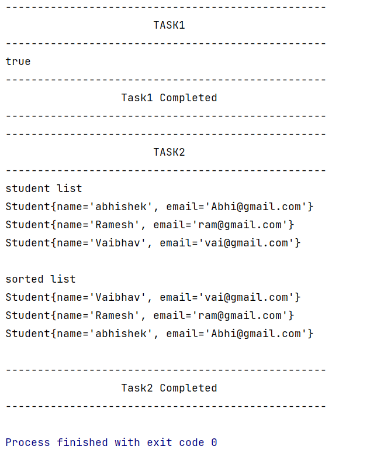

# Java coding question

Create a Student class containing following fields name and email.

Create StudentImpl class containing main method. And perform following tasks

**Task 1**

Inside main method create two objects of Student class and check for equality of both the object, if both the objects
are equal print true otherwise false.

**Task 2**

Create a method `public Student[] sortStudent(Student[] list)` inside StudentImpl class, this method will sort the
student list on the basis of student name in descending order and return the sorted list

**Note:**

Use bubble sort algorithm, library method or collection method for sorting in not allowed, you have to write your own
sorting logic. Free to use any library method apart from sorting methods.

Output formatting is user choice

**sample output**

